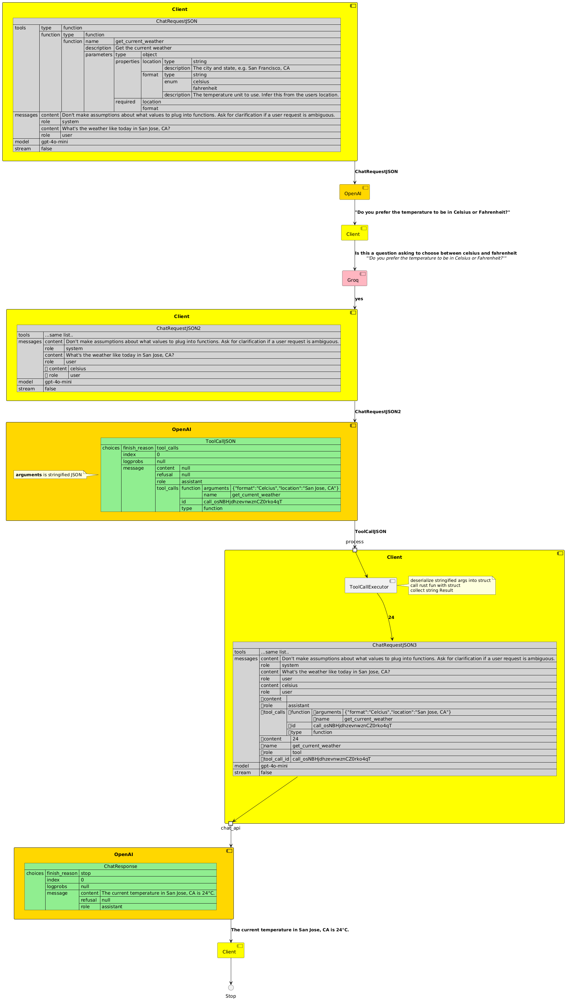

# c06 - Tool Calling example
<!-- TOC -->

- [c06 - Tool Calling example](#c06---tool-calling-example)
- [Flow diagram](#flow-diagram)
- [Code Walkthrough](#code-walkthrough)
    - [Python example from OpenAI](#python-example-from-openai)
    - [Tool function struct and members](#tool-function-struct-and-members)
    - [Setup chat request](#setup-chat-request)
    - [chat loop](#chat-loop)
        - [chat-loop handle assistant response](#chat-loop-handle-assistant-response)
        - [llm_is_yes_no function](#llm_is_yes_no-function)
        - [chat-loop handle tool_calls](#chat-loop-handle-tool_calls)
- [Execution Trace](#execution-trace)

<!-- /TOC -->

---

This example shows how one can use `genai` to implement a slightly cut down version of https://cookbook.openai.com/examples/how_to_call_functions_with_chat_models (_cut down by reducing the tools from 2 to 1_)

 - chat_request adds a tool called `get_current_weather`
 - LLM with the right system message and prompt calls the tool
 - LLM completes it's response based on the response to it's tool call.
 - Tested to work with both Groq and `gpt-4o-mini`
 - Additionally extended to use another LLM to understand and response to the first LLM's initial response.

# Flow diagram

I am using plantuml's component diagrams but making then look like activity diagrams. I want to use JSON components to show the json packets involved and activity diagrams to show the flow to and from the chat end-point. However, the current `allowmixing` feature does not seem to want to allow mixing activity and component diagrams. I am therefore using just components but naming them so they appear to show a serial activity.
  - Show "OpenAI" multiple times using `component "OpenAI" as OAI_Req_2`
  - Use unicode inserter `Win + .` to add ➕ etc to show diffs

See [c06-activity.puml](./puml/c06-activity.puml) for the source of the diagram below.


# Code Walkthrough

## Python example from OpenAI

> Ref: https://cookbook.openai.com/examples/how_to_call_functions_with_chat_models

```python
messages = []
messages.append({
     "role": "system", 
     "content": ("Don't make assumptions about what values to plug into" 
                 " functions. Ask for clarification if a user request is"
                 " ambiguous.")
})
messages.append({"role": "user", "content": "What's the weather like today"})

tools = [
 {
     "type": "function",
     "function": {
         "name": "get_current_weather",
         "description": "Get the current weather",
         "parameters": {
             "type": "object",
             "properties": {
                 "location": {
                     "type": "string",
                     "description": "The city and state, e.g. San Francisco, CA",
                 },
                 "format": {
                     "type": "string",
                     "enum": ["celsius", "fahrenheit"],
                     "description": "The temperature unit to use. Infer this from the users location.",
                 },
             },
             "required": ["location", "format"],
         },
     }
}]
```

## Tool function struct and members

```rust
#[derive(Debug, Serialize, Deserialize, JsonSchema)]
pub enum TemperatureUnits {
    Celcius,
    Farenheit
}

#[derive(Debug, Deserialize, JsonSchema)]
pub struct GetCurrentWeatherParams {    
    /// The city and state, e.g. San Francisco, CA
    pub location: String,

    /// The temperature unit to use. Infer this from the users location.
    pub format : TemperatureUnits,
}

pub fn get_current_weather(params:GetCurrentWeatherParams) -> Result<String> {
    debug!("{:<12} - Called with params: {:?}", "c06 - get_current_weather", params);

    // return hardcoded values for now.
    let res = match params.format {
        TemperatureUnits::Celcius => "24",
        TemperatureUnits::Farenheit => "75"
    }.to_string();

    Ok(res)
}
```

 - Main thing to note here is derivation from `JsonSchema`. `schemars` needs this to generate a schema for  `GetCurrentWeatherParams`
   - the `///` comments are translated into `description:` fields for the tool schema
 - `get_current_weather` has a dummy impl with hardcoded values.

## Setup chat request

```rust
let client = Client::default();
    
let mut chat_req = ChatRequest::default().with_system(
    "Don't make assumptions about what values to plug into functions. Ask for clarification if a user request is ambiguous."
);

// Generate the schema shown in the comments above 
// - from the definition of GetCurrentWeatherParams
// - Manually add name/desc of function.
let gcw_tool_schema = schema_for_fn_single_param::<GetCurrentWeatherParams>(
    "get_current_weather".to_string(), 
    "Get the current weather".to_string(),
);

debug!("{:<12} -  {}", "c06 - get_current_weather tool schema", serde_json::to_string_pretty(&gcw_tool_schema).unwrap());    
chat_req = chat_req.append_tool(
    gcw_tool_schema        
);

chat_req = chat_req.append_message(ChatMessage::user("What's the weather like today in San Jose, CA?"));
```

 - start with system message 
 - generate tool schema with manually provided `function_name`, `function_desc` and automatically created portions from the `GetCurrentWeatherParams`
 - add the required `user` message.

## chat loop

The chat loop is of the following form

```rust
loop {
        let chat_res = client.exec_chat(MODEL, chat_req.clone(), None).await?;
        
        let mut followup_msgs:Option<Vec<ChatMessage>> = None;

        // This crude way of detecting followup questions about which temp
        // sometimes backfires. It needs a stack where once tool-call has been 
        // responded-to. We no longer expect it to ask clarifying questions about
        // which temp unit to use.        
        match chat_res.payload {
            ChatResponsePayload::Content(opt_mc) => {
                // Handle Assistant response
            },
            ChatResponsePayload::ToolCall(opt_tc) => {            
                // Handle assistant tool_call
            }
        }    

        // Continue chat as long as we have followup messages
        if let Some(msgs) = followup_msgs {
            for msg in msgs {
                chat_req = chat_req.append_message(msg);
            }            
        } else {
            break;
        }
    }
```

See the _trace_ section at the end to understand when this loop breaks.

### chat-loop handle assistant response

Read this in the context of the loop skeleton listed above.

```rust
ChatResponsePayload::Content(opt_mc) => {
    // Add the assistant response to the chat_req.
    // Don't add this to the followup_msgs since we don't want this 
    // triggering a loop continuation.
    if let Some(mc) = opt_mc.clone() {
        chat_req = chat_req.append_message(ChatMessage::assistant(mc.clone()));
    }

    let resp = opt_mc
    .as_ref()
    .and_then(MessageContent::text_as_str)
    .unwrap_or("NO ANSWER");

    debug!("{:<12} -  {}", "c06 - processing payload", resp);

    let yn = llm_is_yes_no(&client, resp.to_string(),                 
        "Is this a question asking to choose between celcius and fahrenheit?".to_string())
        .await?;

    if yn {
        // Randomly choose celsius as the response
        debug!("{:<12} - Responding with Celcius to {}", "c06", resp);                    
        followup_msgs
        .get_or_insert(Vec::new())
        .push(
            ChatMessage::user("celsius")
        );
    }
},
```

 - initially apply `MessageContent::text_as_str` to the `MessageContent`
 - Have `llm_is_yes_no` evaluate the assistant response based on the `"Is this a question asking to choose between celcius and fahrenheit?"` predicate
   - if **yes**, add a followup message `ChatMessage::user("celcius")` to respond with "celcius"
   - if **no** pass.

### llm_is_yes_no function

`llm_is_yes_no` is used to automatically response to a LLM response of `"Do you prefer the temperature to be in Celsius or Fahrenheit?"` needs an automated response. This is done by the prompt sent in to the `yes/no` question via the following block

```rust
let yn = llm_is_yes_no(&client, resp.to_string(),                 
        "Is this a question asking to choose between celcius and fahrenheit?".to_string())
        .await?;
```
---

```rust
pub type Result<T> = core::result::Result<T, Error>;

#[derive(Debug, From)]
pub enum Error {
    BotResponseIsEmpty,
    BotResponseIsUnexpected {expected: String, got : String},    

    #[from]
    GenAI(genai::Error),
}

impl core::fmt::Display for Error {
	fn fmt(&self, fmt: &mut core::fmt::Formatter) -> core::result::Result<(), core::fmt::Error> {
		write!(fmt, "{self:?}")
	}
}

impl std::error::Error for Error {}

//-----------------------------------------------------------

async fn llm_is_yes_no(client: &Client, context: String, question: String) -> Result<bool> {
    debug!("{:<12} - Calling groq with question :{} on context: {}", "c06 - llm_is_yes_no", question, context);

    let chat_req = ChatRequest::default()
        .with_system("You are an assistant that answers questions with a yes or no.")
        .append_message(
        ChatMessage::user(format!(
            "I have a question about the text enclosed in triple quotes.
             Please answer it with either a yes or no with no punctuation.

             question : {}
            '''
            {}
            '''", question, context)
        ));

    let chat_res = client
        .exec_chat(INSTANT_MODEL, chat_req, None)
        .await?;

    if let ChatResponsePayload::Content(opt_mc) = chat_res.payload 
    {             
        opt_mc
            .as_ref()
            .and_then(MessageContent::text_as_str)
            .map( |v| {
                    debug!("{:<12} - Processing response {:?}", "c06 - llm_is_yes_no", v);                    
                    match v.trim().to_lowercase().as_str() {
                        "yes" => Ok(true),
                        "no" => Ok(false),
                        _ => {                    
                            Err(Error::BotResponseIsUnexpected {
                                expected : "\"yes\" or \"no\"".to_string(),
                                got : v.to_string()
                            })
                        },
                    }
                })
                .unwrap_or(Err(Error::BotResponseIsEmpty))
    }
    else 
    {        
    Err(Error::BotResponseIsUnexpected{
        expected: "MessageContext response".to_string(),
        got: "Something else".to_string()})
    }
} 
```

 - A system message dedicated to _yes/no answering_. Answer `yes/no` about a supplied context based on the prompt. Remember that the example expects a `yes` for the following and no for any other context (given the same prompt_)
   - **context:** "Do you prefer the temperature to be in Celsius or Fahrenheit?"
   - **prompt:** "Is this a question asking to choose between celcius and fahrenheit?"   
 - Expects a `Content` response (_as opposed to tool_call_) and only proceesses that enum via the `if let` construct
 - normalizes response to lower case and removes ws. _Note that the prompt has been iterated to request no punctutation_.
 - does a simple check on yes/no string literal
 - errors handled appropriately.

### chat-loop handle tool_calls

Read this in the context of the loop skeleton listed above.

```rust
ChatResponsePayload::ToolCall(opt_tc) => {            
    if let Some(tc_vec) =  opt_tc {                    
        debug!("{:<12} -  {:?}", "c06 - Responding to tool_calls", &tc_vec);
        
        let vec = followup_msgs.get_or_insert(Vec::new());

        // OpenAI requires that the assistant's tool_call request be added back 
        // to the chat. Without this, it will reject the subsequent "role=tool" msg.
        vec.push(tc_vec.clone().into());

        for tool_call in &tc_vec {

            debug!("{:<12} - Handling tool_call req for {}", "c06", tool_call.function.fn_name);

            if &tool_call.function.fn_name == "get_current_weather" {

                let fn_result = invoke_with_args(
                    get_current_weather, 
                    tool_call.function.fn_arguments.as_ref(), 
                    &tool_call.function.fn_name);

                // Create the tool msg with function call result.
                let tool_response_msg = ChatMessage::tool_response(
                    tool_call.tool_call_id.clone(), 
                    tool_call.function.fn_name.clone(),
                    fn_result);
                
                debug!("{:<12} - Adding tool_call response {:?}", "c06", &tool_response_msg);

                vec.push(tool_response_msg);
            }
        }                    
    }
}
```

 - Adds the `tool_call` response back to the chat_request via the `followup_msgs` array.
 - Takes the `AssistantToolCall` instance and 
   - deserialize it's `.function.fn_arguments` field into a `GetCurrentWeatherParams` struct
   - applies `get_current_weather` to the `GetCurrentWeatherParams` struct
   - packs the response into a new `ChatMessage::tool_response` message. _Note that the preceding `tool_call` and the `tool_response` messages are linked by their common `id` field value.

# Execution Trace

I am including the full debug trace of the call to `cargo run -p genai --example c06-tool-functions > c06-trace.txt`. The above diagram is constructed from a subset of the information below

```console
DEBUG schema_for_fn_single_param - Schemars for c06_tool_functions::GetCurrentWeatherParams
{
  "$schema": "http://json-schema.org/draft-07/schema#",
  "properties": {
    "format": {
      "description": "The temperature unit to use. Infer this from the users location.",
      "enum": [
        "Celcius",
        "Farenheit"
      ],
      "type": "string"
    },
    "location": {
      "description": "The city and state, e.g. San Francisco, CA",
      "type": "string"
    }
  },
  "required": [
    "format",
    "location"
  ],
  "title": "GetCurrentWeatherParams",
  "type": "object"
}
DEBUG c06 - get_current_weather tool schema -  {
  "function": {
    "description": "Get the current weather",
    "name": "get_current_weather",
    "parameters": {
      "properties": {
        "format": {
          "description": "The temperature unit to use. Infer this from the users location.",
          "enum": [
            "Celcius",
            "Farenheit"
          ],
          "type": "string"
        },
        "location": {
          "description": "The city and state, e.g. San Francisco, CA",
          "type": "string"
        }
      },
      "required": [
        "format",
        "location"
      ],
      "type": "object"
    }
  },
  "type": "function"
}
DEBUG OpenAI.to_web_request_data - {
  "messages": [
    {
      "content": "Don't make assumptions about what values to plug into functions. Ask for clarification if a user request is ambiguous.",
      "role": "system"
    },
    {
      "content": "What's the weather like today in San Jose, CA?",
      "role": "user"
    }
  ],
  "model": "gpt-4o-mini",
  "stream": false,
  "tools": [
    {
      "function": {
        "description": "Get the current weather",
        "name": "get_current_weather",
        "parameters": {
          "properties": {
            "format": {
              "description": "The temperature unit to use. Infer this from the users location.",
              "enum": [
                "Celcius",
                "Farenheit"
              ],
              "type": "string"
            },
            "location": {
              "description": "The city and state, e.g. San Francisco, CA",
              "type": "string"
            }
          },
          "required": [
            "format",
            "location"
          ],
          "type": "object"
        }
      },
      "type": "function"
    }
  ]
}
DEBUG starting new connection: https://api.openai.com/    
DEBUG resolving host="api.openai.com"
DEBUG connecting to 104.18.7.192:443
DEBUG connected to 104.18.7.192:443
DEBUG pooling idle connection for ("https", api.openai.com)
DEBUG gpt-4o-mini - OpenAI.to_chat_response {
  "choices": [
    {
      "finish_reason": "stop",
      "index": 0,
      "logprobs": null,
      "message": {
        "content": "Which temperature unit would you prefer: Celsius or Fahrenheit?",
        "refusal": null,
        "role": "assistant"
      }
    }
  ],
  "created": 1723575896,
  "id": "chatcmpl-9vr7Ab69L0yf3s1Pgbvl8uLichVXK",
  "model": "gpt-4o-mini-2024-07-18",
  "object": "chat.completion",
  "system_fingerprint": "fp_507c9469a1",
  "usage": {
    "completion_tokens": 12,
    "prompt_tokens": 114,
    "total_tokens": 126
  }
}
DEBUG c06 - processing payload -  Which temperature unit would you prefer: Celsius or Fahrenheit?
DEBUG c06 - llm_is_yes_no - Calling groq with question :Is this a question asking to choose between celcius and fahrenheit? on context: Which temperature unit would you prefer: Celsius or Fahrenheit?
DEBUG starting new connection: https://api.groq.com/    
DEBUG resolving host="api.groq.com"
DEBUG connecting to 104.18.3.205:443
DEBUG connected to 104.18.3.205:443
DEBUG pooling idle connection for ("https", api.groq.com)
DEBUG llama-3.1-8b-instant - OpenAI.to_chat_response {
  "choices": [
    {
      "finish_reason": "stop",
      "index": 0,
      "logprobs": null,
      "message": {
        "content": "yes",
        "role": "assistant"
      }
    }
  ],
  "created": 1723575897,
  "id": "chatcmpl-7d624b67-d4f9-487f-a960-9c70b66eeea1",
  "model": "llama-3.1-8b-instant",
  "object": "chat.completion",
  "system_fingerprint": "fp_f66ccb39ec",
  "usage": {
    "completion_time": 0.002666667,
    "completion_tokens": 2,
    "prompt_time": 0.026302166,
    "prompt_tokens": 88,
    "total_time": 0.028968833,
    "total_tokens": 90
  },
  "x_groq": {
    "id": "req_01j56j230dfvsvh6612yvby1q1"
  }
}
DEBUG c06 - llm_is_yes_no - Processing response "yes"
DEBUG c06          - Responding with Celcius to Which temperature unit would you prefer: Celsius or Fahrenheit?
DEBUG OpenAI.to_web_request_data - {
  "messages": [
    {
      "content": "Don't make assumptions about what values to plug into functions. Ask for clarification if a user request is ambiguous.",
      "role": "system"
    },
    {
      "content": "What's the weather like today in San Jose, CA?",
      "role": "user"
    },
    {
      "content": "Which temperature unit would you prefer: Celsius or Fahrenheit?",
      "role": "assistant"
    },
    {
      "content": "celsius",
      "role": "user"
    }
  ],
  "model": "gpt-4o-mini",
  "stream": false,
  "tools": [
    {
      "function": {
        "description": "Get the current weather",
        "name": "get_current_weather",
        "parameters": {
          "properties": {
            "format": {
              "description": "The temperature unit to use. Infer this from the users location.",
              "enum": [
                "Celcius",
                "Farenheit"
              ],
              "type": "string"
            },
            "location": {
              "description": "The city and state, e.g. San Francisco, CA",
              "type": "string"
            }
          },
          "required": [
            "format",
            "location"
          ],
          "type": "object"
        }
      },
      "type": "function"
    }
  ]
}
DEBUG reuse idle connection for ("https", api.openai.com)
DEBUG pooling idle connection for ("https", api.openai.com)
DEBUG gpt-4o-mini - OpenAI.to_chat_response {
  "choices": [
    {
      "finish_reason": "tool_calls",
      "index": 0,
      "logprobs": null,
      "message": {
        "content": null,
        "refusal": null,
        "role": "assistant",
        "tool_calls": [
          {
            "function": {
              "arguments": "{\"format\":\"Celcius\",\"location\":\"San Jose, CA\"}",
              "name": "get_current_weather"
            },
            "id": "call_oa8SGwwXxpYtKh2v4JqF1zmu",
            "type": "function"
          }
        ]
      }
    }
  ],
  "created": 1723575898,
  "id": "chatcmpl-9vr7CuzSGsv5JY9cwX23dGTdaVIWC",
  "model": "gpt-4o-mini-2024-07-18",
  "object": "chat.completion",
  "system_fingerprint": "fp_48196bc67a",
  "usage": {
    "completion_tokens": 23,
    "prompt_tokens": 135,
    "total_tokens": 158
  }
}
DEBUG OpenAI.to_web_request_data/tool_calls -  [
  {
    "function": {
      "arguments": "{\"format\":\"Celcius\",\"location\":\"San Jose, CA\"}",
      "name": "get_current_weather"
    },
    "id": "call_oa8SGwwXxpYtKh2v4JqF1zmu",
    "type": "function"
  }
]
DEBUG c06 - Responding to tool_calls -  [AssistantToolCall { tool_call_id: "call_oa8SGwwXxpYtKh2v4JqF1zmu", tool_call_type: "function", function: AssistantToolCallFunction { fn_name: "get_current_weather", fn_arguments: Some(Object {"format": String("Celcius"), "location": String("San Jose, CA")}) } }]
DEBUG c06          - Handling tool_call req for get_current_weather
DEBUG c06 - get_current_weather - Called with params: GetCurrentWeatherParams { location: "San Jose, CA", format: Celcius }
DEBUG c06          - Adding tool_call response ToolResponse(ToolMessage { tool_call_id: "call_oa8SGwwXxpYtKh2v4JqF1zmu", tool_name: "get_current_weather", tool_result: "24" })
DEBUG OpenAI.to_web_request_data - {
  "messages": [
    {
      "content": "Don't make assumptions about what values to plug into functions. Ask for clarification if a user request is ambiguous.",
      "role": "system"
    },
    {
      "content": "What's the weather like today in San Jose, CA?",
      "role": "user"
    },
    {
      "content": "Which temperature unit would you prefer: Celsius or Fahrenheit?",
      "role": "assistant"
    },
    {
      "content": "celsius",
      "role": "user"
    },
    {
      "content": "",
      "role": "assistant",
      "tool_calls": [
        {
          "function": {
            "arguments": "{\"format\":\"Celcius\",\"location\":\"San Jose, CA\"}",
            "name": "get_current_weather"
          },
          "id": "call_oa8SGwwXxpYtKh2v4JqF1zmu",
          "type": "function"
        }
      ]
    },
    {
      "content": "24",
      "name": "get_current_weather",
      "role": "tool",
      "tool_call_id": "call_oa8SGwwXxpYtKh2v4JqF1zmu"
    }
  ],
  "model": "gpt-4o-mini",
  "stream": false,
  "tools": [
    {
      "function": {
        "description": "Get the current weather",
        "name": "get_current_weather",
        "parameters": {
          "properties": {
            "format": {
              "description": "The temperature unit to use. Infer this from the users location.",
              "enum": [
                "Celcius",
                "Farenheit"
              ],
              "type": "string"
            },
            "location": {
              "description": "The city and state, e.g. San Francisco, CA",
              "type": "string"
            }
          },
          "required": [
            "format",
            "location"
          ],
          "type": "object"
        }
      },
      "type": "function"
    }
  ]
}
DEBUG reuse idle connection for ("https", api.openai.com)
DEBUG gpt-4o-mini - OpenAI.to_chat_response {
  "choices": [
    {
      "finish_reason": "stop",
      "index": 0,
      "logprobs": null,
      "message": {
        "content": "The current temperature in San Jose, CA, is 24°C.",
        "refusal": null,
        "role": "assistant"
      }
    }
  ],
  "created": 1723575899,
  "id": "chatcmpl-9vr7D2lNOyq4foUswM8Ax2SiMEpRv",
  "model": "gpt-4o-mini-2024-07-18",
  "object": "chat.completion",
  "system_fingerprint": "fp_48196bc67a",
  "usage": {
    "completion_tokens": 15,
    "prompt_tokens": 168,
    "total_tokens": 183
  }
}
DEBUG pooling idle connection for ("https", api.openai.com)
DEBUG c06 - processing payload -  The current temperature in San Jose, CA, is 24°C.
DEBUG c06 - llm_is_yes_no - Calling groq with question :Is this a question asking to choose between celcius and fahrenheit? on context: The current temperature in San Jose, CA, is 24°C.
DEBUG reuse idle connection for ("https", api.groq.com)
DEBUG pooling idle connection for ("https", api.groq.com)
DEBUG llama-3.1-8b-instant - OpenAI.to_chat_response {
  "choices": [
    {
      "finish_reason": "stop",
      "index": 0,
      "logprobs": null,
      "message": {
        "content": "no",
        "role": "assistant"
      }
    }
  ],
  "created": 1723575900,
  "id": "chatcmpl-de3787a2-e864-4130-934a-debca46372e6",
  "model": "llama-3.1-8b-instant",
  "object": "chat.completion",
  "system_fingerprint": "fp_9cb648b966",
  "usage": {
    "completion_time": 0.002666667,
    "completion_tokens": 2,
    "prompt_time": 0.020773917,
    "prompt_tokens": 91,
    "total_time": 0.023440584,
    "total_tokens": 93
  },
  "x_groq": {
    "id": "req_01j56j25wcef8v9381gtx2254s"
  }
}
DEBUG c06 - llm_is_yes_no - Processing response "no"
```