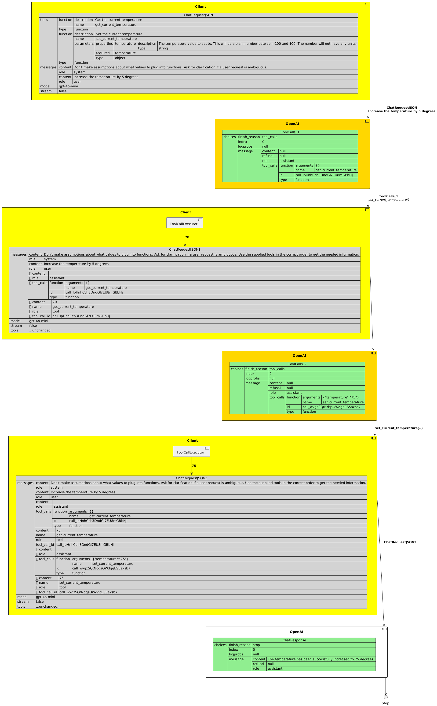
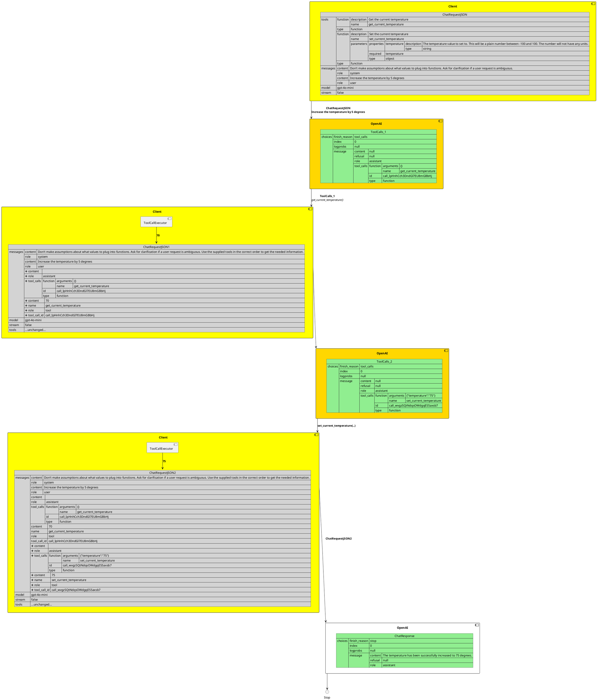

# c07 Example - IOT thermostat setter
<!-- TOC -->

- [c07 Example - IOT thermostat setter](#c07-example---iot-thermostat-setter)
- [Flow Diagram](#flow-diagram)
- [Code walkthrough](#code-walkthrough)
    - [Thermostat modeled as singleton](#thermostat-modeled-as-singleton)
    - [Tool functions](#tool-functions)
- [Execution trace](#execution-trace)

<!-- /TOC -->

This is another example I picked up on the net. It requires the LLM to 
  - Figure out that it needs to make 2 tool calls
  - That it needs to sequence: call one tool and feed it's result into another tool
  - Respond after both tool calls have been made.

This example was run using OpenAI's `gpt-4o-mini` and Groq's tool-preview models. Only OpenAI's models worked. Groq failed
 - `llama3-groq-8b-8192-tool-use-preview` simply called `set_current_temp(5)`. The expectation was that it'd call `get_current_temperature` first and then call `set_current_tempreature` with `current_temp + 5`.
 - `llama3-groq-70b-8192-tool-use-preview` said _I do not have the capability_

# Flow Diagram

See [c07-activity.puml](./puml/c07-activity.puml) for the source of the diagram below.




# Code walkthrough

## Thermostat modeled as singleton

```rust
// Thermostat and functions ------------------------
// The functions manipulate the Thermostat singleton instance
pub fn thermostat() -> &'static Mutex<Thermostat> {
	static INSTANCE: OnceLock<Mutex<Thermostat>> = OnceLock::new();

	INSTANCE.get_or_init(|| {
        let t = Thermostat{temp : "70".to_string() };
        debug!("{:<12} - Initialized to {:?}", "c07 - thermostat()", t.temp);
        Mutex::new(t)
	})
}

// Simplify and keep the val as string instead of parsing float from strings,
// dealing with units etc.
pub struct Thermostat {
	// -- Db
	pub temp: String,
}

impl Thermostat {
    pub fn set_temperature(&mut self, t: String) {
        self.temp = t;
    }
}
```

## Tool functions

```rust
#[derive(Debug, Deserialize, JsonSchema)]
pub struct SetTemperatureParams {    
    /// The temperature value to set to. This will be a plain number between -100 and 100. 
    /// The number will not have any units.
    pub temperature: String,
}

pub fn set_current_temperature(params:SetTemperatureParams) -> Result<String> {
    debug!("{:<12} - Called with params: {:?}", "c06 - set_current_temperature", params);    
    thermostat().lock().unwrap().set_temperature(params.temperature);
    Ok(thermostat().lock().unwrap().temp.clone())
}

pub fn get_current_temperature() -> Result<String> {

    let t = thermostat().lock().unwrap().temp.clone();
    debug!("{:<12} - returning {} ", "c06 - get_current_temperature", t);
    Ok(t)
}
```

 - Note the derivation from `schemars.JsonSchema`
 - The `///` comments get converted to `description` fields for the tool (_see Execution Trace below for actual generated JSON_)
 - 👉 Note: In general, care must be taken that these never fail and always return a string. Modify and update to reflect this.

## Schemas for tool functions

```rust
// Generate the tool schema
// - from the definition of GetCurrentWeatherParams
// - plus name/desc of function.
let sct_tool_schema = schema_for_fn_single_param::<SetTemperatureParams>(
    "set_current_temperature".to_string(), 
    "Set the current temperature".to_string(),
);

let gct_tool_schema = schema_for_fn_no_param(
    "get_current_temperature".to_string(), 
    "Get the current temperature".to_string(),
);

debug!("{:<12} -  {}", "c07 - set_current_temperature tool schema", serde_json::to_string_pretty(&sct_tool_schema).unwrap());    
debug!("{:<12} -  {}", "c07 - get_current_temperature tool schema", serde_json::to_string_pretty(&gct_tool_schema).unwrap());    
```

Nice and simple with the helpers. They produce schemas that look like this:

```console
DEBUG c07 - set_current_temperature tool schema -  {
  "function": {
    "description": "Set the current temperature",
    "name": "set_current_temperature",
    "parameters": {
      "properties": {
        "temperature": {
          "description": "The temperature value to set to. This will be a plain number between -100 and 100. The number will not have any units.",
          "type": "string"
        }
      },
      "required": [
        "temperature"
      ],
      "type": "object"
    }
  },
  "type": "function"
}
DEBUG c07 - get_current_temperature tool schema -  {
  "function": {
    "description": "Get the current temperature",
    "name": "get_current_temperature"
  },
  "type": "function"
}
```

## Initial chat request 

```rust
let mut chat_req = ChatRequest::default().with_system(
        "Don't make assumptions about what values to plug into functions. Ask for clarification if a user request is ambiguous. Use the supplied tools in the correct order to get the needed information.")
        .append_tool(gct_tool_schema)
        .append_tool(sct_tool_schema)
        .append_message(ChatMessage::user("Increase the temperature by 5 degrees"));
```

This is a standard system prompt for tool use. The main user message is the thermostat control message: _Increase the temperature by 5 degrees_.

## chat loop

 Unlike [c06-code-and-traces.md](./c06-code-and-traces.md), this loop only handles the tool_call responses from the LLM. 

```rust
loop {
        let chat_res = client.exec_chat(MODEL, chat_req.clone(), None).await?;
        
        let mut followup_msgs:Option<Vec<ChatMessage>> = None;
        
        match chat_res.payload {
            ChatResponsePayload::Content(opt_mc) => {
                // Handle Assistant chat response
                // -- snip ---
            },
            ChatResponsePayload::ToolCall(opt_tc) => {            
                // Handle assistant tool_call requests
                // Add tool_call response as followup messages
                // -- snip ---
            }
        }    

        // Continue chat as long as we have followup messages
        if let Some(msgs) = followup_msgs {
            for msg in msgs {
                chat_req = chat_req.append_message(msg);
            }            
        } else {
            break;
        }
    }
```

### chat-loop - regular assistant response

Nothing special here. Simply add the response back to the `chat_req`

```rust
// Add the assistant response to the chat_req.
// Don't add this to the followup_msgs since we don't want this 
// triggering a loop continuation.
if let Some(mc) = opt_mc.clone() {
    chat_req = chat_req.append_message(ChatMessage::assistant(mc.clone()));
}

let resp = opt_mc
    .as_ref()
    .and_then(MessageContent::text_as_str)
    .unwrap_or("NO ANSWER");

debug!("{:<12} -  {}", "c07 - processing payload", resp);
```

I considered adding a `opt_mc.inspect(..)` to perform the `chat_req = chat_req.append...` bit but ran into issues with closures and motable closures. Decided to leave that fine-tuning for later.

### chat-loop - tool_call response

This is the main processing body of `c07`: responding to the tool_calls.

```rust
if let Some(tc_vec) =  opt_tc {                    
    debug!("{:<12} -  {:?}", "c07 - Responding to tool_calls", &tc_vec);
    
    // Init for followup messages
    let vec = followup_msgs.get_or_insert(Vec::new());

    // Add the tool_calls to the conversation before adding the response
    vec.push(tc_vec.clone().into());

    for tool_call in &tc_vec {

        debug!("{:<12} - Handling tool_call req for {}", "c07", tool_call.function.fn_name);

        if &tool_call.function.fn_name == "set_current_temperature" {
                                        
            let fn_result = invoke_with_args(
                set_current_temperature,
                tool_call.function.fn_arguments.as_ref(),
                &tool_call.function.fn_name);


            // Create the tool msg with function call result.
            let tool_response_msg = ChatMessage::tool_response(
                tool_call.tool_call_id.clone(), 
                tool_call.function.fn_name.clone(),
                fn_result);
            
            debug!("{:<12} - Adding tool_call response {:?}", "c07", &tool_response_msg);

            vec.push(tool_response_msg);
        }
        else if &tool_call.function.fn_name == "get_current_temperature" {
            
            let fn_result = invoke_no_args(get_current_temperature, &tool_call.function.fn_name);

            // Create the tool msg with function call result.
            let tool_response_msg = ChatMessage::tool_response(
                tool_call.tool_call_id.clone(), 
                tool_call.function.fn_name.clone(),
                fn_result);
            
            debug!("{:<12} - Adding tool_call response {:?}", "c07", &tool_response_msg);

            vec.push(tool_response_msg);
        }                        
    }                    
}
```

 - tool-function processing is done by the `invoke_with_args` and `invoke_no_args` methods.
 - This pattern suggests the need for 
   - a loop construct
   - `HashMap<String, FnOnce(A)->String >` to hold the function and execute it dynamically. Should have `A = ()` when there are no args.
 - Based on use cases, these types of control loops should present low-lying fruit for ergonomic changes.
    


# Execution trace

```console
DEBUG schema_for_fn_single_param - Schemars for c07_tool_settemp::SetTemperatureParams
{
  "$schema": "http://json-schema.org/draft-07/schema#",
  "properties": {
    "temperature": {
      "description": "The temperature value to set to. This will be a plain number between -100 and 100. The number will not have any units.",
      "type": "string"
    }
  },
  "required": [
    "temperature"
  ],
  "title": "SetTemperatureParams",
  "type": "object"
}
DEBUG c07 - set_current_temperature tool schema -  {
  "function": {
    "description": "Set the current temperature",
    "name": "set_current_temperature",
    "parameters": {
      "properties": {
        "temperature": {
          "description": "The temperature value to set to. This will be a plain number between -100 and 100. The number will not have any units.",
          "type": "string"
        }
      },
      "required": [
        "temperature"
      ],
      "type": "object"
    }
  },
  "type": "function"
}
DEBUG c07 - get_current_temperature tool schema -  {
  "function": {
    "description": "Get the current temperature",
    "name": "get_current_temperature"
  },
  "type": "function"
}
DEBUG OpenAI.to_web_request_data - {
  "messages": [
    {
      "content": "Don't make assumptions about what values to plug into functions. Ask for clarification if a user request is ambiguous. Use the supplied tools in the correct order to get the needed information.",
      "role": "system"
    },
    {
      "content": "Increase the temperature by 5 degrees",
      "role": "user"
    }
  ],
  "model": "gpt-4o-mini",
  "stream": false,
  "tools": [
    {
      "function": {
        "description": "Get the current temperature",
        "name": "get_current_temperature"
      },
      "type": "function"
    },
    {
      "function": {
        "description": "Set the current temperature",
        "name": "set_current_temperature",
        "parameters": {
          "properties": {
            "temperature": {
              "description": "The temperature value to set to. This will be a plain number between -100 and 100. The number will not have any units.",
              "type": "string"
            }
          },
          "required": [
            "temperature"
          ],
          "type": "object"
        }
      },
      "type": "function"
    }
  ]
}
DEBUG starting new connection: https://api.openai.com/    
DEBUG resolving host="api.openai.com"
DEBUG connecting to 104.18.6.192:443
DEBUG connected to 104.18.6.192:443
DEBUG pooling idle connection for ("https", api.openai.com)
DEBUG gpt-4o-mini - OpenAI.to_chat_response {
  "choices": [
    {
      "finish_reason": "tool_calls",
      "index": 0,
      "logprobs": null,
      "message": {
        "content": null,
        "refusal": null,
        "role": "assistant",
        "tool_calls": [
          {
            "function": {
              "arguments": "{}",
              "name": "get_current_temperature"
            },
            "id": "call_k6eC4Nx67OpEcPjm5y8G1iug",
            "type": "function"
          }
        ]
      }
    }
  ],
  "created": 1723576072,
  "id": "chatcmpl-9vrA0yD2oWy8yfrx7RgWmaUiPkhm0",
  "model": "gpt-4o-mini-2024-07-18",
  "object": "chat.completion",
  "system_fingerprint": "fp_48196bc67a",
  "usage": {
    "completion_tokens": 11,
    "prompt_tokens": 128,
    "total_tokens": 139
  }
}
DEBUG OpenAI.to_web_request_data/tool_calls -  [
  {
    "function": {
      "arguments": "{}",
      "name": "get_current_temperature"
    },
    "id": "call_k6eC4Nx67OpEcPjm5y8G1iug",
    "type": "function"
  }
]
DEBUG c07 - Responding to tool_calls -  [AssistantToolCall { tool_call_id: "call_k6eC4Nx67OpEcPjm5y8G1iug", tool_call_type: "function", function: AssistantToolCallFunction { fn_name: "get_current_temperature", fn_arguments: Some(Object {}) } }]
DEBUG c07          - Handling tool_call req for get_current_temperature
DEBUG c07 - thermostat() - Initialized to "70"
DEBUG c06 - get_current_temperature - returning 70 
DEBUG c07          - Adding tool_call response ToolResponse(ToolMessage { tool_call_id: "call_k6eC4Nx67OpEcPjm5y8G1iug", tool_name: "get_current_temperature", tool_result: "70" })
DEBUG OpenAI.to_web_request_data - {
  "messages": [
    {
      "content": "Don't make assumptions about what values to plug into functions. Ask for clarification if a user request is ambiguous. Use the supplied tools in the correct order to get the needed information.",
      "role": "system"
    },
    {
      "content": "Increase the temperature by 5 degrees",
      "role": "user"
    },
    {
      "content": "",
      "role": "assistant",
      "tool_calls": [
        {
          "function": {
            "arguments": "{}",
            "name": "get_current_temperature"
          },
          "id": "call_k6eC4Nx67OpEcPjm5y8G1iug",
          "type": "function"
        }
      ]
    },
    {
      "content": "70",
      "name": "get_current_temperature",
      "role": "tool",
      "tool_call_id": "call_k6eC4Nx67OpEcPjm5y8G1iug"
    }
  ],
  "model": "gpt-4o-mini",
  "stream": false,
  "tools": [
    {
      "function": {
        "description": "Get the current temperature",
        "name": "get_current_temperature"
      },
      "type": "function"
    },
    {
      "function": {
        "description": "Set the current temperature",
        "name": "set_current_temperature",
        "parameters": {
          "properties": {
            "temperature": {
              "description": "The temperature value to set to. This will be a plain number between -100 and 100. The number will not have any units.",
              "type": "string"
            }
          },
          "required": [
            "temperature"
          ],
          "type": "object"
        }
      },
      "type": "function"
    }
  ]
}
DEBUG reuse idle connection for ("https", api.openai.com)
DEBUG gpt-4o-mini - OpenAI.to_chat_response {
  "choices": [
    {
      "finish_reason": "tool_calls",
      "index": 0,
      "logprobs": null,
      "message": {
        "content": null,
        "refusal": null,
        "role": "assistant",
        "tool_calls": [
          {
            "function": {
              "arguments": "{\"temperature\":\"75\"}",
              "name": "set_current_temperature"
            },
            "id": "call_7Zf3IVQ7o2PwMzbiqKF1EJua",
            "type": "function"
          }
        ]
      }
    }
  ],
  "created": 1723576073,
  "id": "chatcmpl-9vrA166bIZgUVwpmFlRcwhfXhOIXG",
  "model": "gpt-4o-mini-2024-07-18",
  "object": "chat.completion",
  "system_fingerprint": "fp_507c9469a1",
  "usage": {
    "completion_tokens": 15,
    "prompt_tokens": 149,
    "total_tokens": 164
  }
}
DEBUG pooling idle connection for ("https", api.openai.com)
DEBUG OpenAI.to_web_request_data/tool_calls -  [
  {
    "function": {
      "arguments": "{\"temperature\":\"75\"}",
      "name": "set_current_temperature"
    },
    "id": "call_7Zf3IVQ7o2PwMzbiqKF1EJua",
    "type": "function"
  }
]
DEBUG c07 - Responding to tool_calls -  [AssistantToolCall { tool_call_id: "call_7Zf3IVQ7o2PwMzbiqKF1EJua", tool_call_type: "function", function: AssistantToolCallFunction { fn_name: "set_current_temperature", fn_arguments: Some(Object {"temperature": String("75")}) } }]
DEBUG c07          - Handling tool_call req for set_current_temperature
DEBUG c06 - set_current_temperature - Called with params: SetTemperatureParams { temperature: "75" }
DEBUG c07          - Adding tool_call response ToolResponse(ToolMessage { tool_call_id: "call_7Zf3IVQ7o2PwMzbiqKF1EJua", tool_name: "set_current_temperature", tool_result: "75" })
DEBUG OpenAI.to_web_request_data - {
  "messages": [
    {
      "content": "Don't make assumptions about what values to plug into functions. Ask for clarification if a user request is ambiguous. Use the supplied tools in the correct order to get the needed information.",
      "role": "system"
    },
    {
      "content": "Increase the temperature by 5 degrees",
      "role": "user"
    },
    {
      "content": "",
      "role": "assistant",
      "tool_calls": [
        {
          "function": {
            "arguments": "{}",
            "name": "get_current_temperature"
          },
          "id": "call_k6eC4Nx67OpEcPjm5y8G1iug",
          "type": "function"
        }
      ]
    },
    {
      "content": "70",
      "name": "get_current_temperature",
      "role": "tool",
      "tool_call_id": "call_k6eC4Nx67OpEcPjm5y8G1iug"
    },
    {
      "content": "",
      "role": "assistant",
      "tool_calls": [
        {
          "function": {
            "arguments": "{\"temperature\":\"75\"}",
            "name": "set_current_temperature"
          },
          "id": "call_7Zf3IVQ7o2PwMzbiqKF1EJua",
          "type": "function"
        }
      ]
    },
    {
      "content": "75",
      "name": "set_current_temperature",
      "role": "tool",
      "tool_call_id": "call_7Zf3IVQ7o2PwMzbiqKF1EJua"
    }
  ],
  "model": "gpt-4o-mini",
  "stream": false,
  "tools": [
    {
      "function": {
        "description": "Get the current temperature",
        "name": "get_current_temperature"
      },
      "type": "function"
    },
    {
      "function": {
        "description": "Set the current temperature",
        "name": "set_current_temperature",
        "parameters": {
          "properties": {
            "temperature": {
              "description": "The temperature value to set to. This will be a plain number between -100 and 100. The number will not have any units.",
              "type": "string"
            }
          },
          "required": [
            "temperature"
          ],
          "type": "object"
        }
      },
      "type": "function"
    }
  ]
}
DEBUG reuse idle connection for ("https", api.openai.com)
DEBUG pooling idle connection for ("https", api.openai.com)
DEBUG gpt-4o-mini - OpenAI.to_chat_response {
  "choices": [
    {
      "finish_reason": "stop",
      "index": 0,
      "logprobs": null,
      "message": {
        "content": "The temperature has been successfully increased to 75 degrees.",
        "refusal": null,
        "role": "assistant"
      }
    }
  ],
  "created": 1723576074,
  "id": "chatcmpl-9vrA2Sd554vKTMEAsXKWjRkwXuAQg",
  "model": "gpt-4o-mini-2024-07-18",
  "object": "chat.completion",
  "system_fingerprint": "fp_507c9469a1",
  "usage": {
    "completion_tokens": 12,
    "prompt_tokens": 174,
    "total_tokens": 186
  }
}
DEBUG c07 - processing payload -  The temperature has been successfully increased to 75 degrees.

```